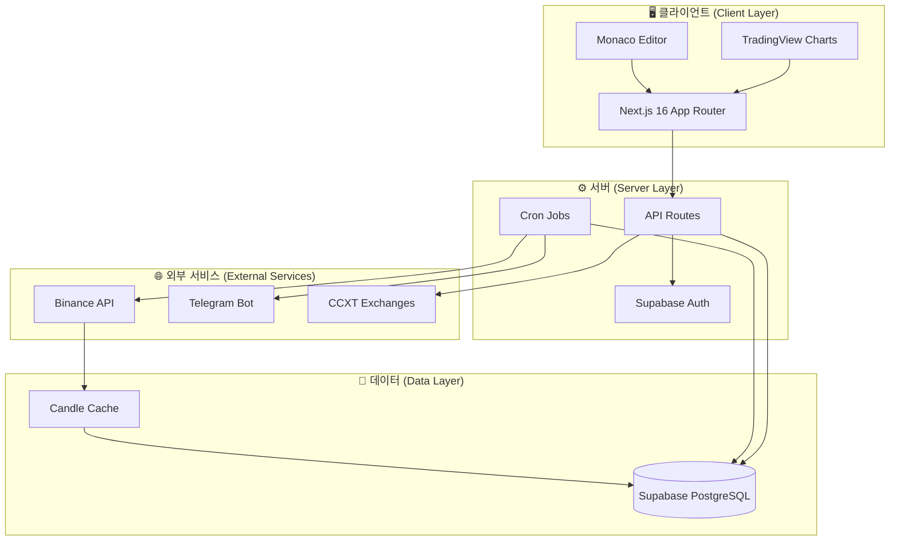
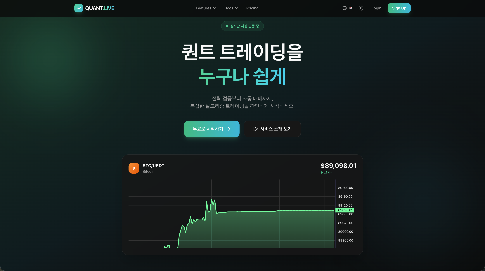

# 📈 Quant Live Dashboard

<div align="center">

**실시간 백테스팅 및 전략 마켓플레이스를 갖춘 AI 기반 퀀트 트레이딩 플랫폼**

[](https://nextjs.org/)
[](https://react.dev/)
[](https://www.typescriptlang.org/)
[](https://supabase.com/)
[](https://tailwindcss.com/)

[Live Demo](https://quant-live-dashboard.vercel.app) · [주요 기능](#-주요-기능) · [기술 스택](#-기술-스택) · [시작하기](#-시작하기)

</div>

---

## ✨ 주요 기능 (Features)

### 📊 전략 연구소 (Strategy Lab) - 백테스팅 엔진

- **Pine Script 변환기**: TradingView의 Pine Script 문법으로 전략 작성 가능
- **과거 데이터 분석**: 바이낸스(Binance) 실시간 시장 데이터를 활용한 전략 테스트
- **성과 지표 분석**: Sharpe Ratio, 수익률, 승률 등 다양한 지표 제공
- **인터랙티브 차트**: 매수/매도 마커가 표시되는 TradingView 스타일의 캔들 차트

### 🛒 전략 마켓플레이스 (Strategy Marketplace)

- 트레이딩 전략 공유 및 탐색
- 커뮤니티 평점 및 리뷰 시스템
- 원클릭 전략 다운로드 및 배포

### 🤖 24/7 자동매매 봇 (Automated Trading Bots)

- 실시간 매매 신호 감지
- CCXT를 통한 다중 거래소 지원 (Binance, OKX 등)
- 텔레그램(Telegram) 알림 봇 연동
- 안전한 API 키 암호화 저장 (AES-256-GCM)

### 🌐 다국어 지원 (Global)

- 완벽한 다국어 지원 (한국어, 영어)
- RTL(Right-to-Left) 지원 아키텍처

---

## 🛠 기술 스택 (Tech Stack)

### Frontend

| 기술 (Technology)  | 용도 (Purpose)                                 |
| ------------------ | ---------------------------------------------- |
| **Next.js 16**     | App Router, 서버 컴포넌트, API 라우트          |
| **React 19**       | 최신 React 동시성 기능 활용                    |
| **TypeScript 5.9** | 타입 안정성 보장                               |
| **Tailwind CSS 4** | Glassmorphism 디자인 및 유틸리티 기반 스타일링 |
| **Radix UI**       | 웹 접근성이 준수된 Headless UI 컴포넌트        |
| **Framer Motion**  | 부드러운 애니메이션 효과                       |
| **Zustand**        | 가볍고 효율적인 상태 관리                      |

### Backend & Data

| 기술 (Technology) | 용도 (Purpose)                                     |
| ----------------- | -------------------------------------------------- |
| **Supabase**      | PostgreSQL 데이터베이스 + Row Level Security (RLS) |
| **Supabase Auth** | 소셜 로그인(구글, 카카오) + 세션 관리              |
| **CCXT**          | 암호화폐 거래소 통합 API                           |
| **Binance API**   | 실시간 시장 데이터 수집 (WebSocket + REST)         |

### DevOps

| 기술 (Technology) | 용도 (Purpose)                |
| ----------------- | ----------------------------- |
| **Vercel**        | Edge 배포 및 자동화된 CI/CD   |
| **Docker**        | 컨테이너화된 개발 환경        |
| **pnpm**          | 빠르고 효율적인 패키지 매니저 |

---

## 🏗 아키텍처 (Architecture)



---

## 📁 프로젝트 구조 (Project Structure)

```
quant-live-dashboard/
├── app/                    # Next.js App Router 페이지
│   ├── [locale]/           # 다국어 라우팅 (en, ko)
│   │   ├── dashboard/      # 보호된 대시보드 페이지
│   │   └── (public)/       # 공개 페이지 (랜딩, 가격 정책 등)
│   └── api/                # API 라우트
│       ├── auth/           # 인증 관련 엔드포인트
│       ├── bots/           # 봇 관리
│       ├── cron/           # 스케줄러 작업
│       └── strategies/     # 전략 마켓플레이스
├── features/               # 기능별 모듈
│   ├── backtest/           # 백테스팅 엔진 + Pine Script 파서
│   ├── trade/              # 거래소 연동 및 봇 실행기
│   ├── marketplace/        # 전략 마켓플레이스 로직
│   └── social/             # 소셜 기능
├── components/             # 재사용 가능한 UI 컴포넌트
├── lib/                    # 유틸리티 및 설정
│   ├── supabase/           # Supabase 클라이언트
│   └── security/           # 보안 모듈 (AES-256-GCM)
└── supabase/               # 데이터베이스 마이그레이션 파일
```

---

## 🚀 시작하기 (Getting Started)

### 필수 요구사항 (Prerequisites)

- Node.js 20 이상
- pnpm 9 이상
- Supabase 프로젝트

### 설치 및 실행 (Installation)

```bash
# 저장소 복제 (Clone)
git clone https://github.com/yourusername/quant-live-dashboard.git
cd quant-live-dashboard

# 패키지 설치
pnpm install

# 환경 변수 설정
cp .env.example .env.local
# .env.local 파일을 열어 Supabase 설정값을 입력하세요

# 개발 서버 실행
pnpm dev
```

브라우저에서 [http://localhost:3000](http://localhost:3000)을 열어 확인하세요.

### 환경 변수 (Environment Variables)

```env
NEXT_PUBLIC_SUPABASE_URL=your_supabase_url
NEXT_PUBLIC_SUPABASE_ANON_KEY=your_anon_key
SUPABASE_SERVICE_ROLE_KEY=your_service_role_key
SERVER_ENCRYPTION_KEY=your_32_char_encryption_key
```

---

## 🧪 핵심 기술적 도전 (Key Technical Challenges)

### 1. Pine Script 변환기 (Pine Script Transpiler)

TradingView의 Pine Script 문법을 실행 가능한 JavaScript로 변환하는 커스텀 트랜스파일러를 구현하여, 사용자가 익숙한 언어로 전략을 작성할 수 있도록 지원했습니다.

### 2. 서버 사이드 세션 관리 (Server-Side Session Management)

Supabase SSR을 도입하고 쿠키를 적절히 핸들링하여, 클라이언트와 서버 컴포넌트 간의 매끄러운 인증 상태 동기화를 구현했습니다.

### 3. 실시간 데이터 파이프라인 (Real-time Data Pipeline)

Binance API로부터 증분 업데이트(Incremental Update)를 받아 효율적으로 데이터를 캐싱하고, 350,000개 이상의 캔들 데이터를 백테스팅에 활용할 수 있도록 최적화했습니다.

### 4. 안전한 키 관리 (Secure Key Management)

사용자의 민감한 API 키를 AES-256-GCM 알고리즘으로 암호화하여 저장하며, 거래소 자격 증명이 평문으로 노출되지 않도록 서버 사이드에서만 복호화하여 사용합니다.

---

## 📸 스크린샷 (Screenshots)

<div align="center">

### 랜딩 페이지 (Landing Page)



</div>

---

## 📈 로드맵 (Roadmap)

- [ ] 다중 거래소 차익거래(Arbitrage) 탐지
- [ ] AI 기반 전략 추천 시스템
- [ ] 모바일 반응형 PWA 지원
- [ ] 소셜 카피 트레이딩 (Copy Trading)
- [ ] 고급 리스크 관리 기능

## 📬 연락처 (Contact)

- **Email**: jangwooseng97@gmail.com
- **GitHub**: [@woosung-dev](https://github.com/woosung-dev)

---

<div align="center">

**Built with ❤️ using Next.js, React, and Supabase**

</div>
