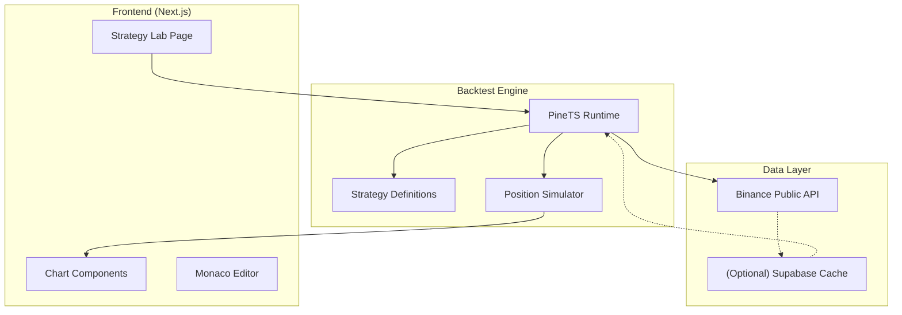
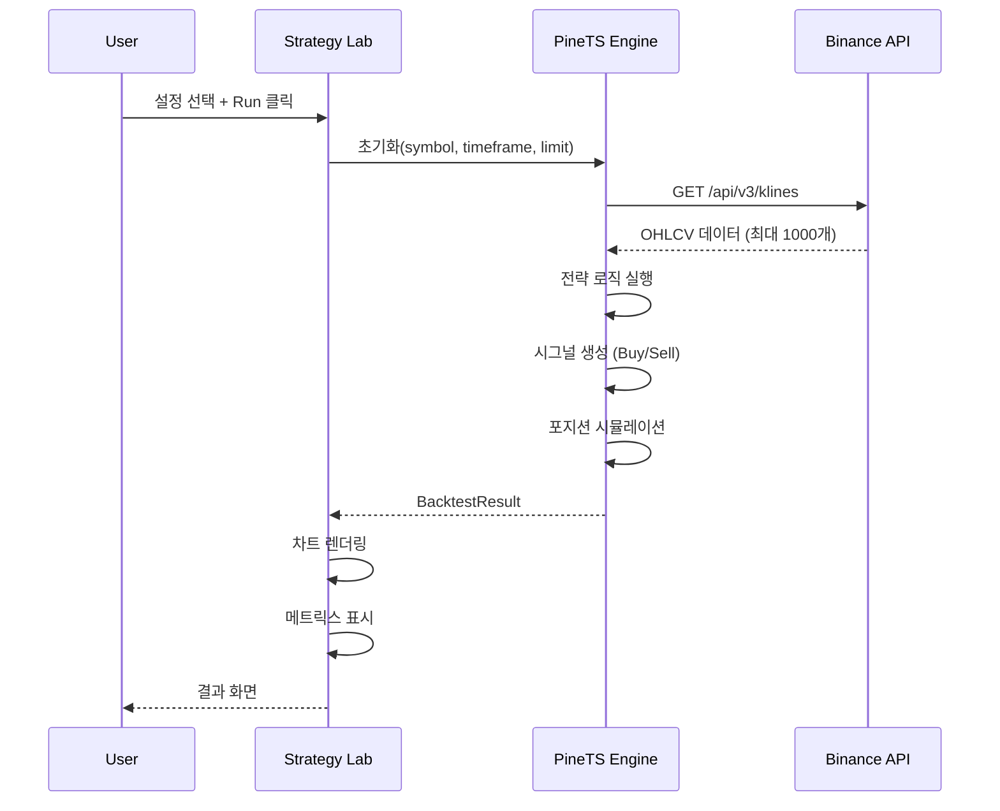
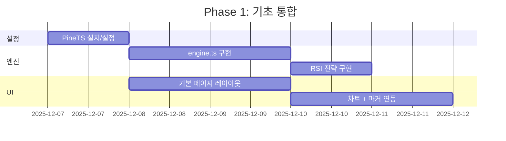

# Quant Live Dashboard - 백테스팅 기술 구현 계획서

> **문서 버전**: v1.0  
> **작성일**: 2025-12-06  
> **상태**: 설계 완료, 개발 대기

---

## 1. 기술 스택

### 1.1 Frontend

| 기술 | 버전 | 용도 |
|------|------|------|
| Next.js | 16.x | 프레임워크 |
| TypeScript | 5.x | 타입 안전성 |
| Tailwind CSS | 4.x | 스타일링 |
| Lightweight Charts | 5.x | 캔들/라인 차트 |
| Monaco Editor | 0.55.x | 코드 에디터 (기존) |
| Lucide React | - | 아이콘 |

### 1.2 백테스팅 엔진

| 기술 | 용도 |
|------|------|
| **PineTS** | Pine Script 호환 TypeScript 프레임워크 |
| technicalindicators | 보조 지표 라이브러리 (필요시) |

### 1.3 데이터 소스

| 소스 | 용도 | 비고 |
|------|------|------|
| Binance API | 캔들 데이터 | 무료, API 키 불필요 |
| (Future) Upbit API | 원화 마켓 | Phase 3 |

### 1.4 인프라

| 서비스 | 용도 |
|--------|------|
| Vercel | Frontend 호스팅 |
| Supabase | Auth, DB (필요시 캐싱용) |

---

## 2. 아키텍처

### 2.1 시스템 구조도



### 2.2 데이터 흐름



---

## 3. 핵심 컴포넌트 설계

### 3.1 디렉토리 구조

```
app/
├── [locale]/
│   └── dashboard/
│       └── strategy-lab/
│           ├── page.tsx                 # 메인 페이지
│           ├── layout.tsx               # 레이아웃
│           └── components/
│               ├── StrategySelector.tsx # 전략 선택 드롭다운
│               ├── ParameterForm.tsx    # 동적 파라미터 폼
│               ├── TimeframeSelector.tsx# 타임프레임 버튼그룹
│               ├── BacktestChart.tsx    # 차트 + 마커
│               ├── IndicatorChart.tsx   # 지표 서브차트
│               ├── MetricsCards.tsx     # 핵심 지표 카드
│               ├── ResultTabs.tsx       # 탭 컨테이너
│               ├── SummaryTab.tsx       # 요약 탭
│               ├── AnalysisTab.tsx      # 분석 탭
│               └── TradeLogTable.tsx    # 거래 목록 테이블

lib/
├── backtest/
│   ├── index.ts                         # 엔진 메인 export
│   ├── engine.ts                        # PineTS 래퍼
│   ├── types.ts                         # 타입 정의
│   ├── utils.ts                         # 유틸리티 함수
│   └── strategies/
│       ├── index.ts                     # 전략 레지스트리
│       ├── base.ts                      # 기본 Strategy 인터페이스
│       ├── rsi-divergence.ts            # RSI Divergence
│       ├── ema-cross.ts                 # EMA Cross
│       └── macd.ts                      # MACD

components/
├── charts/
│   ├── CandlestickChart.tsx             # (기존 활용)
│   └── EquityCurve.tsx                  # 수익 곡선
```

### 3.2 주요 모듈 설명

| 모듈 | 책임 |
|------|------|
| `engine.ts` | PineTS 초기화, 실행, 결과 변환 |
| `types.ts` | 모든 인터페이스/타입 정의 |
| `strategies/*.ts` | 개별 전략 로직 |
| `BacktestChart.tsx` | 차트 렌더링 + 마커 오버레이 |
| `MetricsCards.tsx` | 5개 핵심 지표 카드 |

---

## 4. 핵심 타입 정의

```typescript
// lib/backtest/types.ts

/** 지원 타임프레임 */
export type Timeframe = '1m' | '5m' | '15m' | '30m' | '1h' | '2h' | '4h' | '6h' | '12h' | '1d' | '1w';

/** 백테스트 설정 */
export interface BacktestConfig {
  symbol: string;
  timeframe: Timeframe;
  startDate?: Date;
  endDate?: Date;
  limit?: number;           // 기본 1000
  initialCapital: number;   // 기본 10000
}

/** 전략 파라미터 정의 */
export interface ParameterDefinition {
  name: string;
  label: string;
  type: 'number' | 'select' | 'boolean';
  defaultValue: number | string | boolean;
  min?: number;
  max?: number;
  options?: { label: string; value: string }[];
}

/** 전략 인터페이스 */
export interface Strategy {
  id: string;
  name: string;
  description: string;
  parameters: ParameterDefinition[];
  code: string;  // PineTS 코드
}

/** 캔들 데이터 */
export interface Candle {
  time: number;      // Unix timestamp (seconds)
  open: number;
  high: number;
  low: number;
  close: number;
  volume: number;
}

/** 시그널 */
export interface Signal {
  time: number;
  type: 'buy' | 'sell';
  price: number;
  reason?: string;
}

/** 거래 기록 */
export interface Trade {
  id: number;
  type: 'long' | 'short';
  entryTime: number;
  entryPrice: number;
  exitTime: number;
  exitPrice: number;
  quantity: number;
  pnl: number;
  pnlPercent: number;
  cumulativePnl: number;
}

/** 수익 곡선 포인트 */
export interface EquityPoint {
  time: number;
  equity: number;
  drawdown: number;
}

/** 성과 지표 */
export interface PerformanceMetrics {
  netProfit: number;
  netProfitPercent: number;
  grossProfit: number;
  grossLoss: number;
  maxDrawdown: number;
  maxDrawdownPercent: number;
  totalTrades: number;
  winningTrades: number;
  losingTrades: number;
  winRate: number;
  profitFactor: number;
  avgWin: number;
  avgLoss: number;
  avgWinPercent: number;
  avgLossPercent: number;
  maxWin: number;
  maxLoss: number;
  avgTradeDuration: number;
}

/** 백테스트 결과 */
export interface BacktestResult {
  config: BacktestConfig;
  strategy: Strategy;
  candles: Candle[];
  signals: Signal[];
  trades: Trade[];
  equityCurve: EquityPoint[];
  metrics: PerformanceMetrics;
  executionTime: number;  // ms
}
```

---

## 5. 데이터 스펙

### 5.1 Binance API 연동

**Endpoint**
```
GET https://api.binance.com/api/v3/klines
```

**Parameters**
| 파라미터 | 타입 | 필수 | 설명 |
|----------|------|------|------|
| symbol | string | ✅ | 거래쌍 (예: BTCUSDT) |
| interval | string | ✅ | 타임프레임 (예: 1h, 4h, 1d) |
| limit | number | ❌ | 캔들 수 (기본 500, 최대 1000) |
| startTime | number | ❌ | 시작 시간 (ms) |
| endTime | number | ❌ | 종료 시간 (ms) |

**Response (Array)**
```typescript
[
  [
    1499040000000,      // Open time (ms)
    "0.01634000",       // Open
    "0.80000000",       // High
    "0.01575800",       // Low
    "0.01577100",       // Close
    "148976.11427815",  // Volume
    1499644799999,      // Close time (ms)
    "2434.19055334",    // Quote asset volume
    308,                // Number of trades
    "1756.87402397",    // Taker buy base asset volume
    "28.46694368",      // Taker buy quote asset volume
    "17928899.62484339" // Ignore
  ],
  // ...
]
```

### 5.2 지원 타임프레임

| 코드 | 설명 | 1000개 = 기간 |
|------|------|--------------|
| 1m | 1분 | ~16시간 |
| 5m | 5분 | ~3.5일 |
| 15m | 15분 | ~10일 |
| 1h | 1시간 | ~41일 |
| 4h | 4시간 | ~166일 |
| 12h | 12시간 | ~1.4년 |
| 1d | 1일 | ~2.7년 |

### 5.3 Rate Limits

| 항목 | 제한 |
|------|------|
| Weight | 2 per request |
| Request limit | 1200/min |
| Max klines | 1000/request |

---

## 6. 구현 로드맵

### 6.1 Phase 1: 기초 통합 (1주)



**작업 목록**
- [ ] `npm install pinets` 설치
- [ ] `lib/backtest/engine.ts` 구현
- [ ] `lib/backtest/strategies/rsi-divergence.ts` 구현
- [ ] `app/[locale]/dashboard/strategy-lab/page.tsx` 생성
- [ ] `BacktestChart.tsx` 구현
- [ ] `MetricsCards.tsx` 구현

### 6.2 Phase 2: UI 완성 (1주)

**작업 목록**
- [ ] `ParameterForm.tsx` 동적 폼
- [ ] `TimeframeSelector.tsx` 버튼 그룹
- [ ] `IndicatorChart.tsx` RSI 서브차트
- [ ] `ResultTabs.tsx` 탭 UI
- [ ] `SummaryTab.tsx` 요약 테이블
- [ ] `AnalysisTab.tsx` 통계 테이블
- [ ] `TradeLogTable.tsx` 거래 목록 (페이지네이션)
- [ ] 추가 전략: EMA Cross, MACD

### 6.3 Phase 3: 고급 기능 (2주)

**작업 목록**
- [ ] 다중 심볼 지원
- [ ] 코드 에디터 (PineTS 직접 작성)
- [ ] Pine Script → PineTS 자동 변환
- [ ] 알림 시스템 연동
- [ ] DB 캐싱 레이어 (성능 최적화)

---

## 7. 테스트 계획

### 7.1 단위 테스트

| 대상 | 테스트 내용 |
|------|------------|
| engine.ts | 캔들 데이터 로딩 |
| engine.ts | 시그널 생성 정확성 |
| strategies | 각 전략별 로직 |
| utils | 지표 계산 정확성 |

### 7.2 통합 테스트

| 시나리오 | 기대 결과 |
|----------|----------|
| BTCUSDT 1D 1000개 백테스트 | 3초 이내 완료 |
| 모든 타임프레임 테스트 | 데이터 정상 로딩 |
| 파라미터 변경 후 재실행 | 결과 갱신 |

### 7.3 E2E 테스트

| 플로우 | 검증 |
|--------|------|
| 설정 → 실행 → 결과 확인 | UI 정상 렌더링 |
| 전략 변경 | 파라미터 폼 갱신 |
| 탭 전환 | 내용 정상 표시 |

---

## 8. 리스크 및 대응

| 리스크 | 영향 | 대응 |
|--------|------|------|
| PineTS 미지원 함수 | 일부 전략 구현 불가 | 자체 구현 또는 대체 로직 |
| Binance Rate Limit | 요청 실패 | 요청 간격 조절, 캐싱 |
| 대용량 데이터 처리 | 브라우저 느려짐 | Web Worker, 페이지네이션 |
| PineTS 버그 | 계산 오류 | 수동 검증, 이슈 리포트 |
