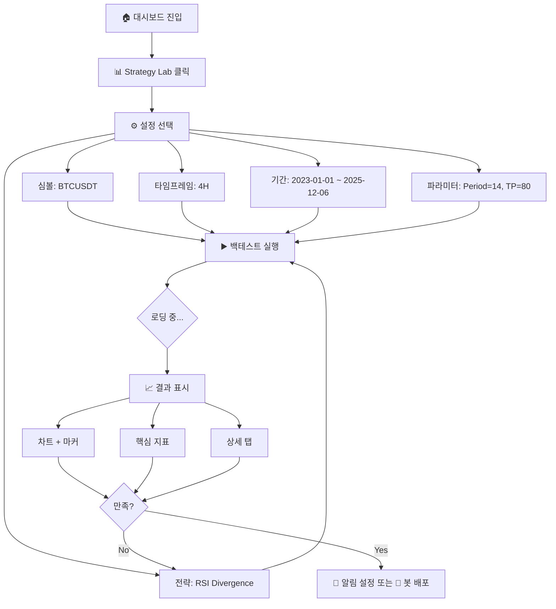

# Quant Live Dashboard - 백테스팅 기능 상세 기획서

> **문서 버전**: v1.0  
> **작성일**: 2025-12-06  
> **상태**: 기획 완료, 개발 대기

---

## 1. 프로젝트 개요

### 1.1 비전 & 미션

> **"TradingView for Execution"**
> 
> 분석(Backtest) → 모니터링(Alert) → 실행(Trade)을 하나의 플랫폼에서 완결

TradingView는 훌륭한 차트와 분석 도구를 제공하지만, 실제 매매로 연결하려면 복잡한 외부 연동이 필요합니다.  
**Quant Live Dashboard**는 이 갭을 메우고, **원클릭으로 분석에서 실매매까지** 이어지는 경험을 제공합니다.

### 1.2 타겟 사용자

| 유형 | 특성 | 핵심 니즈 |
|------|------|----------|
| **초보 트레이더** | 코딩 경험 없음 | 검증된 전략 + 간단한 파라미터 조정 |
| **중급 트레이더** | 지표 사용 경험 있음 | 자신만의 전략 백테스팅 |
| **개발자/퀀트** | 코딩 가능 | 커스텀 전략 작성 + API 연동 |

### 1.3 핵심 가치 제안

| 경쟁사 | 우리 플랫폼 |
|--------|------------|
| 차트 중심, 매매는 별도 | **분석 → 알림 → 자동매매 원스톱** |
| 영어 위주 | **한국어 네이티브** |
| Pine Script 학습 필요 | **노코드 파라미터 조정** |
| 이메일/웹훅 알림만 | **카카오톡 알림 지원** |

---

## 2. 기능 정의

### 2.1 전략 관리

| 기능 | 설명 | MVP |
|------|------|-----|
| 전략 라이브러리 | 사전 정의된 전략 목록 (RSI, MACD, EMA Cross 등) | ✅ |
| 파라미터 설정 | 전략별 동적 입력 폼 | ✅ |
| 코드 뷰어 | 전략 로직 확인 (읽기 전용) | ✅ |
| 커스텀 전략 | PineTS 코드 직접 작성 | Phase 2 |
| Pine Script 변환 | 붙여넣기 → 자동 변환 | Phase 3 |

### 2.2 백테스팅 엔진

| 기능 | 설명 | MVP |
|------|------|-----|
| 심볼 선택 | BTCUSDT, ETHUSDT 등 | ✅ |
| 타임프레임 | 5m, 15m, 1H, 4H, 12H, 1D | ✅ |
| 기간 설정 | 시작일 ~ 종료일 | ✅ |
| 초기 자본 | 시뮬레이션 시작 금액 | ✅ |
| 롱/숏 지원 | 양방향 포지션 | ✅ |
| 피라미딩 | 다중 진입 | Phase 2 |

### 2.3 시각화 및 분석

| 기능 | 설명 | MVP |
|------|------|-----|
| 캔들 차트 | OHLCV 시각화 | ✅ |
| Buy/Sell 마커 | 진입/청산 시점 표시 | ✅ |
| 지표 서브차트 | RSI, MACD 등 | ✅ |
| 수익 곡선 | Equity Curve | ✅ |
| 핵심 지표 카드 | 순이익, 승률, MDD 등 | ✅ |
| 요약 탭 | 전체/롱/숏 분리 성과 | ✅ |
| 거래 분석 탭 | 상세 통계 | ✅ |
| 거래 목록 탭 | 개별 거래 내역 | ✅ |

### 2.4 알림 시스템 (Phase 2)

| 채널 | 설명 |
|------|------|
| 웹훅 | Slack, Discord 연동 |
| 텔레그램 | 봇 알림 |
| 카카오톡 | 카카오 알림톡 |

### 2.5 실시간 봇 배포 (Phase 3)

| 기능 | 설명 |
|------|------|
| 봇 배포 | 백테스트 설정 → 라이브 봇 |
| 거래소 연동 | Binance, Upbit |

---

## 3. 화면 구성 (상세)

### 3.1 페이지 URL
```
/dashboard/strategy-lab
```

### 3.2 전체 레이아웃

```
┌─────────────────────────────────────────────────────────────────┐
│  HEADER BAR                                                      │
│  ┌──────────┐ ┌──────────────────┐ ┌───────────┐ ┌────────────┐ │
│  │ BTCUSDT ▼│ │ 5m 15m 1H 4H 1D │ │ 📅 기간    │ │ ▶ 백테스트 │ │
│  └──────────┘ └──────────────────┘ └───────────┘ └────────────┘ │
├─────────────────────────────────────────────────────────────────┤
│                                                                  │
│  ┌─────────────────┐  ┌─────────────────────────────────────┐   │
│  │ STRATEGY CONFIG │  │           PRICE CHART                │   │
│  │                 │  │  ┌─────────────────────────────────┐ │   │
│  │ 전략 선택 ▼     │  │  │                                 │ │   │
│  │ ┌─────────────┐ │  │  │   캔들스틱 + Buy/Sell 마커      │ │   │
│  │ │RSI Divergence│ │  │  │                                 │ │   │
│  │ └─────────────┘ │  │  │          [BUY]    [SELL]        │ │   │
│  │                 │  │  │                                 │ │   │
│  │ ─── 파라미터 ─── │  │  └─────────────────────────────────┘ │   │
│  │                 │  │  ┌─────────────────────────────────┐ │   │
│  │ RSI Period      │  │  │        RSI 서브차트              │ │   │
│  │ ┌────┐          │  │  │  ━━━━━━━━━ 70 ━━━━━━━━━━        │ │   │
│  │ │ 14 │          │  │  │       ~~~∿~~~                   │ │   │
│  │ └────┘          │  │  │  ━━━━━━━━━ 30 ━━━━━━━━━━        │ │   │
│  │                 │  │  └─────────────────────────────────┘ │   │
│  │ Take Profit RSI │  └─────────────────────────────────────┘   │
│  │ ┌────┐          │                                            │
│  │ │ 80 │          │                                            │
│  │ └────┘          │                                            │
│  │                 │                                            │
│  │ Stop Loss %     │                                            │
│  │ ┌────┐          │                                            │
│  │ │ 5  │          │                                            │
│  │ └────┘          │                                            │
│  │                 │                                            │
│  │ [📄 코드 보기]  │                                            │
│  └─────────────────┘                                            │
│                                                                  │
├─────────────────────────────────────────────────────────────────┤
│  METRICS CARDS                                                   │
│  ┌──────────┐ ┌──────────┐ ┌──────────┐ ┌──────────┐ ┌────────┐ │
│  │ 순이익   │ │ 최대낙폭 │ │ 거래횟수 │ │  승률    │ │ 손익비 │ │
│  │ +64,571  │ │  29.71%  │ │   442    │ │  28.73%  │ │  1.17  │ │
│  │  +64.71% │ │  🔴      │ │          │ │          │ │  🟢    │ │
│  └──────────┘ └──────────┘ └──────────┘ └──────────┘ └────────┘ │
├─────────────────────────────────────────────────────────────────┤
│  RESULT TABS                                                     │
│  ┌────────┐ ┌────────────┐ ┌────────────┐                       │
│  │  요약  │ │ 거래 분석  │ │ 거래 목록  │                       │
│  └────────┘ └────────────┘ └────────────┘                       │
│  ┌─────────────────────────────────────────────────────────────┐│
│  │                                                              ││
│  │              [탭 내용 영역]                                  ││
│  │                                                              ││
│  └─────────────────────────────────────────────────────────────┘│
└─────────────────────────────────────────────────────────────────┘
```

### 3.3 컴포넌트 상세 스펙

#### 3.3.1 Header Bar

| 요소 | 타입 | 옵션 |
|------|------|------|
| 심볼 선택 | Dropdown | BTCUSDT, ETHUSDT, BNBUSDT, XRPUSDT, SOLUSDT |
| 타임프레임 | Button Group | 5m, 15m, 1H, 4H, 12H, 1D |
| 기간 선택 | Date Range Picker | 최근 1개월 ~ 최대 3년 |
| 백테스트 버튼 | Primary Button | 클릭 시 실행 |

#### 3.3.2 Strategy Config Panel

| 요소 | 타입 | 동작 |
|------|------|------|
| 전략 Dropdown | Select | 전략 변경 시 파라미터 폼 갱신 |
| 파라미터 폼 | Dynamic Form | 전략별 input(), slider 등 |
| 코드 보기 | Toggle Button | 클릭 시 코드 모달 표시 |

#### 3.3.3 Price Chart

| 요소 | 라이브러리 | 설명 |
|------|-----------|------|
| 캔들스틱 | Lightweight Charts | OHLC 표시 |
| 볼륨 바 | Lightweight Charts | 하단 볼륨 히스토그램 |
| Buy 마커 | Markers API | 녹색 상향 화살표 |
| Sell 마커 | Markers API | 빨간색 하향 화살표 |

#### 3.3.4 Indicator Subchart

| 요소 | 설명 |
|------|------|
| RSI 라인 | 보라색 선 |
| 70 레벨 | 점선 (과매수) |
| 30 레벨 | 점선 (과매도) |
| 배경 | 30-70 구간 연한 보라색 |

#### 3.3.5 Metrics Cards

| 카드 | 형식 | 색상 규칙 |
|------|------|----------|
| 순이익 | +64,571 USDT (+64.71%) | 양수=🟢, 음수=🔴 |
| 최대낙폭(MDD) | 39,269 USDT (29.71%) | 항상 🔴 |
| 거래횟수 | 442 | 중립 |
| 승률 | 28.73% | >50%=🟢, <50%=🔴 |
| 손익비 | 1.17 | >1=🟢, <1=🔴 |

#### 3.3.6 Result Tabs

**요약 탭 (Summary)**
| 항목 | 전체 | 롱 | 숏 |
|------|------|-----|-----|
| 초기 자본 | 100,000 | - | - |
| 순이익 | +64,571 | +55,403 | +9,168 |
| 총수익 | 441,213 | 247,160 | 194,053 |
| 총손실 | -376,635 | -187,763 | -185,575 |

**거래 분석 탭 (Trade Analysis)**
| 항목 | 값 |
|------|-----|
| 총 거래횟수 | 442 |
| 수익 거래 | 127 |
| 손실 거래 | 315 |
| 평균 수익 거래 | 3,476 USDT |
| 평균 손실 거래 | 1,194 USDT |
| 최대 수익 거래 | 20,320 USDT |
| 최대 손실 거래 | 6,627 USDT |

**거래 목록 탭 (Trade Log)**
| # | 날짜 | 종류 | 진입가 | 청산가 | 손익 | 수익률 |
|---|------|------|--------|--------|------|--------|
| 442 | 2025-12-06 | Short | 89,330 | 88,657 | +335 | +0.4% |
| 441 | 2025-12-03 | Long | 91,277 | 91,785 | -1,847 | -2.1% |
| ... | ... | ... | ... | ... | ... | ... |

---

## 4. 사용자 플로우



---

## 5. MVP 범위 정의

### ✅ MVP (Phase 1) - 2주
- [ ] PineTS 통합
- [ ] 3개 기본 전략 (RSI, EMA Cross, MACD)
- [ ] 1개 심볼 (BTCUSDT)
- [ ] 모든 타임프레임 지원
- [ ] 차트 + 마커 시각화
- [ ] 핵심 지표 5개
- [ ] 거래 목록 테이블

### ⏳ Phase 2 - 2주
- [ ] 다중 심볼 지원
- [ ] 추가 전략 5개
- [ ] 요약/분석 탭 완성
- [ ] 코드 에디터 (PineTS 직접 작성)
- [ ] 알림 시스템 (Webhook)

### 🔮 Phase 3 - 3주
- [ ] Pine Script 자동 변환
- [ ] 커뮤니티 전략 공유
- [ ] 실시간 봇 배포
- [ ] 거래소 연동

---

## 6. 성공 지표 (KPI)

| 지표 | 목표 |
|------|------|
| 백테스트 실행 시간 | < 3초 (1000 캔들) |
| 일일 백테스트 횟수 | 100회+ |
| 사용자 리텐션 (7일) | 40%+ |
| 봇 배포 전환율 | 10%+ |
